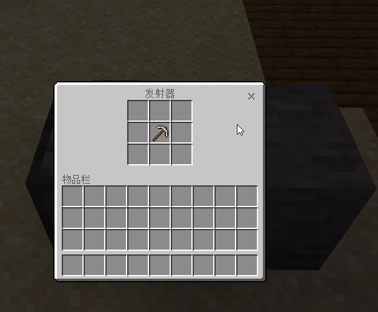

# DispenserDestroyBlock
### 使发射器能使特点的物品破坏特点的方块


---

演示:


- 依赖 [LiteLoader.dll](https://github.com/LiteLDev/LiteLoaderBDS)加载器
- 将插件 `DispenserDestroyBlock.dll` 拖入`plugins`文件夹中开服即可

- 配置文件:`plugins\DispenserDestroyBlock\DispenserDestroyBlock.json`
- `consume_durable`: 用有耐久的工具破坏时是否消耗耐久(附魔无效) 默认`true`
- `instant_destruction`: 是瞬间破坏方块还是像生存玩家一样有一个破坏过程(该项无效) 默认`false`
- `stay_in_the_Dispenser`: 当工具破坏时,方块不是配置中的可破坏方块,是否像原版一样将物品发射出去，默认`true`
- `destroy`: 改项为JSON对象，配置哪些物品可破坏哪些方块
- `destroy->key`: destroy的key为可用作破坏的物品,比如斧头,稿子,其值为JSON对象
- `destroy->key->val[dropitem]`: `dropitem`破坏后要掉落的物品,为""时掉落破坏的方块
- `destroy->key->val[count]`: `count`破坏物品掉落的个数,dropitem为""时，该项无效
- 默认:

```json
{
  "consume_durable": true,
  "destroy": {
    "minecraft:iron_axe": {
      "minecraft:log": {
        "count": 1,
        "dropitem": ""
      },
      "minecraft:log2": {
        "count": 1,
        "dropitem": ""
      }
    },
    "minecraft:iron_pickaxe": {
      "minecraft:cobblestone": {
        "count": 1,
        "dropitem": ""
      },
      "minecraft:stone": {
        "count": 1,
        "dropitem": "minecraft:cobblestone"
      }
    }
  },
  "instant_destruction": false,
  "stay_in_the_Dispenser": true
}
```


